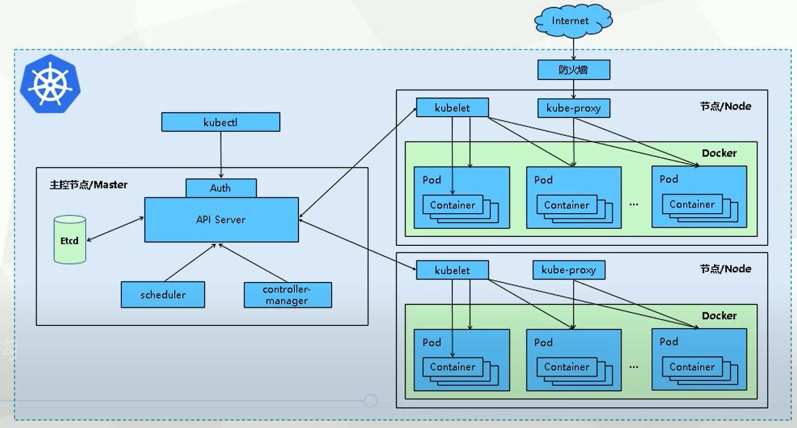

<h3 a
<h2 align="center">K8S源码阅读笔记</h2>

> 以下笔记针对 `kubernetes V1.23.1`（截至2022年01月01日最新版本），并不保证对其它版本的有效性

### 一、架构图

### 二、阅读前准备

> 由于`kubernetes`项目巧妙的设计和代码高度的封装性，建议在阅读代码前，尽可能的进行以下内容的准备：

#### 1. 编程知识配备

* `编程语准备`: 学习`golang`语法，并额外对`cobra`、`pflag`、`flag`等包有一定了解，了解go module机制
* `环境准备`：配置并熟悉`golang`程序的调试，额外掌握在带有命令行参数的情境下如何调试

#### 2. 系统、网络及安全知识

* 学习`HTTPS`通信与`TLS`加密
* 掌握`X.509`证书基本要素
* 了解`Bootstrap`机制（`kubelet`向`kube-ApiServer`注册时使用）
* 基本了解网络代理、容器技术
* 掌握`YAML`、`JSON`编码格式

#### 3. kubernetes组件运行

* 掌握`kubernetes`基础概念，例如`pod`和`deployment`等。了解各组件的作用以及之间的关系、通信方式和大体流程
* 手动从kubernetes源码编译获得二进制文件，掌握`kubernetes`从`源码`构建`二进制`的具体过程
* 手动从二进制文件配置一个多节点集群，从中加深了解`kubernetes`组件的运行关系，以及深入了解`kubernetes`单个组件启动参数含义，同时可以借此形成单个组件的良好调试运行环境。
  * 基于二进制构建`kubernetes`是较为复杂的，且随着版本更新旧的方式逐渐失效，直到`V1.23.1`已没有完美教程，为此通过博客的方式详细记录此次集群搭建过程，可供参考：[从二进制搭建kubernetes v1.23.1集群](https://www.aflyingfish.top/articles/205801b55ca4/)。*(由于教程是在实验做完后补上，可能有小部分缺失，如果您发现了问题请尽快取得联系！)*

### 三、源码剖析

#### 1. [API-Server](apiserver)

提供了资源操作的唯一入口，并提供认证、授权、访问控制、API注册和发现等机制

#### 2. [Controller-manager](controller-manager)

负责维护集群的状态，比如故障检测、自动扩展、滚动更新等

#### 3. [Kube-Scheduler](kube-scheduler)

负责资源的调度，按照预定的调度策略将Pod调度到相应的机器上

#### 4. [Kubelet](kubelet)

负责维护容器的生命周期，同时也负责Volume（CVI）和网络（CNI）的管理

#### 5. [Kube-proxy](kube-proxy)

负责为Service提供cluster内部的服务发现和负载均衡

#### 6. [Kube-ctl](kubectl)

#### 7. [ 技术补充](others)

#### 8. [ 示例代码参考](demo_code)

