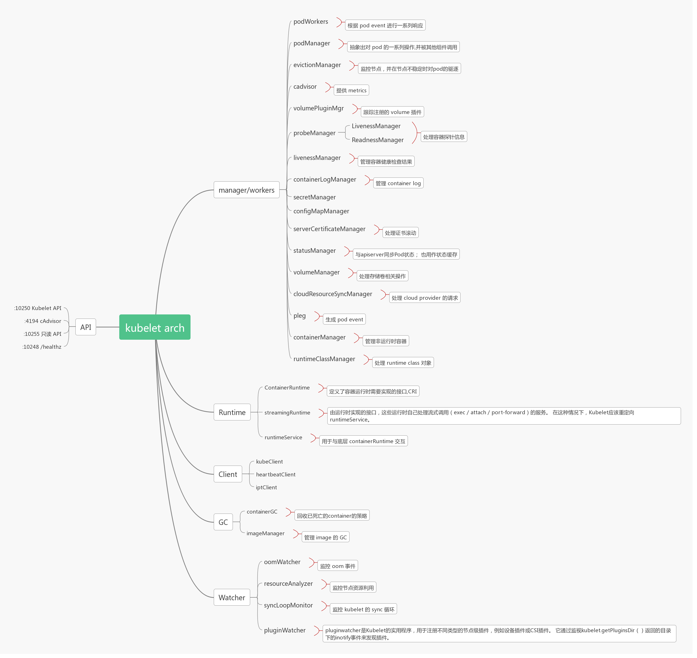
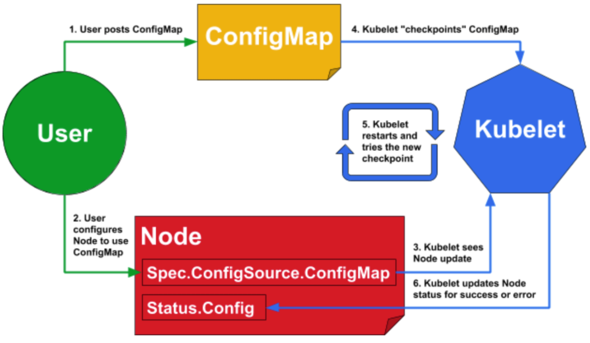

<h2 align="center">Kubelet源码阅读笔记</h2>

> 主体程序路径：`kubernetes/cmd/kubelet`
>
> 实验环境：
>
> * 服务器：
>   * 系统：`Centos 7.9`
>   * go：`v1.17.5`
> * 本地：
>   * 系统：`Windows 10`
>   * 开发环境：`VS Code` + `SSH-Remote`
> * kubernetes：`v1.23.1`
>
> 说明：为了阅读方便，快速抓住核心，本文中的示例代码在源代码的基础上可能存在略微调整、伪代码化等等操作。如果阅读时存在排版疑问，请以文档原始编辑器(`typora v0.11.17 beta for windows`)为准

#### 1. 简介

* 主要源码结构

    ```shell
    kubelet/
    ├── app
    │   ├── auth.go
    │   ├── init_others.go
    │   ├── init_windows.go
    │   ├── init_windows_test.go
    │   ├── options
    │   │   ├── container_runtime.go
    │   │   ├── globalflags.go
    │   │   ├── globalflags_linux.go
    │   │   ├── globalflags_other.go
    │   │   ├── globalflags_providerless.go
    │   │   ├── globalflags_providers.go
    │   │   ├── options.go
    │   │   ├── options_test.go
    │   │   ├── osflags_others.go
    │   │   └── osflags_windows.go
    │   ├── OWNERS
    │   ├── plugins.go
    │   ├── plugins_providerless.go
    │   ├── plugins_providers.go
    │   ├── server_bootstrap_test.go
    │   ├── server.go
    │   ├── server_linux.go
    │   ├── server_others.go
    │   ├── server_test.go
    │   ├── server_unsupported.go
    │   └── server_windows.go
    ├── kubelet.go
    └── OWNERS
    ```

* 内部组件架构

  

#### 2. 程序入口：

```go
func main() {
    // 通过 command.Execute() 执行
    command := app.NewKubeletCommand()	// type: *cobra.Command，创建kubelet命令行应用
    
	code := run(command)				// 运行kubelet并记录日志，进程正常情况不会退出
	os.Exit(code)						// 出错时返回1，结束进程；否则返回0
}
```

#### 3. kubelet命令行创建

> 即实例化 var command *cobra.command

```go
func NewKubeletCommand() *cobra.Command {
	// ...
	return cmd
}
```

* 默认初始化cleanFlagSet结构

  ```go
  cleanFlagSet := pflag.NewFlagSet(componentKubelet, pflag.ContinueOnError)
  ```

  * type: pflag.FlagSet

  * 作用：类似pflag结构的定义，用于生成命令行应用

  * 拓展：

    * pflag的三种使用方式

      > import "github.com/spf13/pflag"

      * 方式一：
    
        ```go
        flagSet := pflag.NewFlagSet("main", pflag.ExitOnError)
        
        version := flagSet.BoolP("version", "v", false, "print version string")		// 参数定义
        flagSet.Parse(os.Args[1:])													// 解析：命令应用启动参数
        
        // 读取：使用参数
        // 方法一：
        fmt.Println(*version)		
        
        // 方法二：
        value, _ := flagSet.GetBool("version")
        fmt.Println(value)
        ```
      
      * 方式二：
      
        ```go
        flagSet := pflag.NewFlagSet("main", pflag.ExitOnError)
        flagSet.Parse(os.Args[1:])													// 解析：命令应用启动参数
        value, _ := flagSet.GetBool("version")										// 读取：使用参数
        fmt.Println(value)
        ```
      
        
      
      * 方式三：
      
        ```go
        version := pflag.BoolP("version","v", false, "print version string")		// 参数定义
        pflag.Parse()																// 解析
        
        fmt.println(version)														// 读取
        ```
      
      * 附加：
      
        若使用package为golang内置的`flag`而不是`pflag`（增强版），可使用如下：
      
        ```go
        flagSet := flag.NewFlagSet("main", flag.ExitOnError)
        
        version := flagSet.Bool("version", false, "print version string")			// 参数定义
        flagSet.Parse(os.Args[1:])													// 解析：命令应用启动参数
        
        // 读取：使用参数
        // 方法一：
        value := flagSet.Lookup("version").Value.(flag.Getter).Get().(bool)			
        fmt.Println(value)
        
        // 方法二
        fmt.Println(*version)														
        ```
      
      > 启动参照： ./go_exec --version=true
    

* 默认初始化kubeletFlags结构

  ```go
  // 默认值初始化KubeletFlags结构,包括docker,证书路径，插件目录，CIDR等等
  kubeletFlags := options.NewKubeletFlags()
  ```

  * type: `option.KubeletFlags`
  * 作用：从`kubelet`命令启动时追加的参数（Flags）后期存储到该结构
  * **集群各node节点之间不共享的配置集**

* 默认初始化`kubeletConfig`结构

  ```go
  kubeletConfig, err := options.NewKubeletConfiguration()
  ```

  * type: `config.kubeletConfiguration`

  * 作用：从配置文件`--config=$PATH/kubelet.config`获取的参数后期存储到该结构

  * **集群各node节点之间共享的配置集**

  * `kubelet.config`文件内容示例：

    ```yaml
    kind: KubeletConfiguration
    apiVersion: kubelet.config.k8s.io/v1beta1
    authentication:
      x509:
        clientCAFile: /opt/kubernetes/ssl/ca.pem
      webhook:
        enabled: true
        cacheTTL: 2m0s
      anonymous:
        enabled: false
    authorization:
      mode: Webhook
      webhook:
        cacheAuthorizedTTL: 5m0s
        cacheUnauthorizedTTL: 30s
    address: $NODE_IP
    port: 10250
    readOnlyPort: 10255
    cgroupDriver: systemd
    hairpinMode: promiscuous-bridge
    serializeImagePulls: false
    clusterDomain: cluster.local.
    clusterDNS:
      - 10.0.0.2
    ```

* cmd初始化

  * `DisableFlagParsing: true`

    >  即禁用cobra包的flags自动解析。flags会被直接解析为参数`args`的一部分（注意`子命令`不是`flags`），其中包括`--help`等。
  
    以下通过简单示例说明此参数影响：
  
    * `DisableFlagParsing: false`

      ```shell
      apt-get install package -f
      
      # 解析结果
      command: `apt-get install`
      flags: ["-f"]
      args: ["package"]
      ```
  
    * `DisableFlagParsing: true`

      ```shell
      apt-get install package -f
      
      # 解析结果
      command: `apt-get install`
      flags: []
      args: ["-f","package"]
      ```
  
    * 将此参数值设置为`true`，使得`kubelet`可以在`Run`函数里，完全自定义可控的方式处理程序

  * Run函数编写

    > 即执行kubelet命令时的调用入口函数

    * 对程序的输入命令进行初步解析，判断输入参数合法性

      * `cleanFlagSet.Parse(args)`

        > * 解析程序flags
        >
        > * 如果出现有未定义的flags，将返回error
  
      * `cleanFlagSet.Args()`

        > * 解析程序子命令
        > * kubelet并不支持子命令，将直接报错并结束程序
  
    * `cleanFlagSet.GetBool("help")`

      > 判断是否包含`--help`，有则直接跳转到`kubelet help`，结束程序

    * `verflag.PrintAndExitIfRequested()`

      >* 解析`--version`字段
      >
      >* 内部基于`type versionValue int`手动约定枚举类型`versionValue`
      >
      >* `var versionFlag = Version(versionFlagName, VersionFalse, "Print version information and quit")` 
      >
      >  > 实质上就是基于`pflag`将一个`*versionValue`类型的值绑定到名为`versionFlagName`的`flag`,其默认值为`VersionFalse`，真实值存储在`versionFlag`
      >  >
      >
      >* 使用`AddFlags(fs *flag.FlagSet)`将此处声明的`flag`注册到`fs`中，即可接受到程序真实的参数输入
      >
      >* 传入值：
      >
      >  > * `"raw"` : 打印`版本号`，结束进程
      >  >
      >  >   > 例如：
      >  >   >
      >  >   > ```shell
      >  >   > version.Info{Major:"1", Minor:"23", GitVersion:"v1.23.1", GitCommit:"86ec240af8cbd1b60bcc4c03c20da9b98005b92e", GitTreeState:"clean", BuildDate:"2021-12-16T11:39:51Z", GoVersion:"go1.17.5", Compiler:"gc", Platform:"linux/amd64"}
      >  >   > ```
      >  >
      >  > * `"true"`: 打印`程序名（此处默认为字符串"Kubernetes"）+版本号`，结束进程
      >  >
      >  >   > 例如：
      >  >   >
      >  >   > ```shell
      >  >   > Kubernetes v1.23.1
      >  >   > ```
      >  >
      >  > * `"false"`: 直接结束函数，无操作
      >
      >额外补充：
      >
      >```go
      >// 此接口为pflag包内容
      >type Value interface {
      >	String() string
      >	Set(string) error
      >	Type() string
      >}
      >
      >// 注意：可见到在verflag.go中对约定的枚举类型versionValue实现了pflag.Value接口
      >
      >// verflag.go: line 77~78
      >*p = value					// 这里的p可以是自定义类型，只要实现了pflag.Value接口就行。此处实质上是*Int（手动约定枚举类型）
      >flag.Var(p, name, usage)	// 即定义一个flag标志，与p绑定，默认值为value，名称为name，用法为usage
      >
      >// *p = VersionFalse		// VersionFalse = 0			
      >// flag.Var(p, "version", "Print version information and quit")
      >```
  
    * `utilfeature.DefaultMutableFeatureGate.SetFromMap(kubeletConfig.FeatureGates)`
  
      > `kubeletConfig.FeatureGates`为`map[string]bool`类型，存储了k8s alpha/experimental版本特性是否启用
      >
      > 此函数作用：
      >
      > * 用`kubeletConfig.FeatureGates`覆盖默认的`FeatureGates`参数项
      >   * 内部核心实现涉及`know：Map`（存储了所有已知的特性及其描述）和`enable: Map`（存储了实际的特性及其开关状态）
      > * 拦截对未知特性的设置
      > * 拦截对禁止修改（通过`know[Feature_name].LockToDefault : bool`进行判定）的特性的设置
  
    * `options.ValidateKubeletFlags(kubeletFlags)`
  
      > * 验证是否有非`kubelet`支持的flag（该结构决定存储的flag一定是`kubernetes`支持的，但不一定是`kubelet`支持）
      > * 验证flag的设置是否与其它选项的设置冲突，例如`FeatureGate`（可能将某特性设置为禁用）
  
    * 对容器运行时为`remote`时可能出现的错误给出提示
  
    * 从文件加载`KubeletConfig`参数
  
      > 先从配置文件读取，如果命令行同时指定其中某字段，优先级：命令行>配置文件
      >
      > 特例：针对`KubeletConfig.FeatureGates`，未冲突字段采用合并的方式，冲突字段优先级：命令行>配置文件
      >
      >
      > 说明：巧妙的用了一个临时`pflag.FlagSet`而非最终保留的`FlagSet`结构来对命令行参数进行再次解析，不会因此影响到`KubeletFlags`，避免了整个应用的重复解析问题。
  
      * 从磁盘文件`kubelet.config`读取配置文件: `kubeletConfig,err = loadConfigFile(configFile)`
  
          * `DefaultFs`
  
            > `utilfs.DefaultFs`实质上是对默认OS文件操作的一种封装，目的是可以自动的在所有传入的文件path前面自动加上一个`root`路径

            代码：
  
            ```go
            type DefaultFs struct {
                root string
            }
  
            // 实现举例
            func (fs *DefaultFs) Remove(name string) error {
                real_name := filepath.Join(fs.root, name)		// 自动加上前缀

                return os.Remove(real_name)
            }
            // ...
            ```

          * `loader := configfiles.NewFsLoader(...)`
  
            ```go
            func NewFsLoader(fs utilfs.Filesystem, kubeletFile string) (Loader, error) {
  
                // 此处初始化一个kubelet的默认文件编解码器：kubeletCodecs
  
                return &fsLoader{
                    fs:            fs,				// 即为DefaultFs类型
                    kubeletCodecs: kubeletCodecs,
                    kubeletFile:   kubeletFile,
                }, nil
            }
            ```
  
          * 数据读取以及格式化
  
            ```go
            func (loader *fsLoader) Load() (*kubeletconfig.KubeletConfiguration, error) {
                data, err := loader.fs.ReadFile(loader.kubeletFile)
            
                // ...
            
                kc, err := utilcodec.DecodeKubeletConfiguration(loader.kubeletCodecs, data)
            
                // ...
            
                // 读取kubeletconfig结构中所有路径字段的指针，形成 []*string
                paths := kubeletconfig.KubeletConfigurationPathRefs(kc)
            
                // 读取kubelet.config文件所在目录，作为root目录
                root_dir := filepath.Dir(loader.kubeletFile)
            
                // 将kubeletconfig结构中所有字段的目录，修改为：
                // *path = filepath.Join(root_dir, *path)
                resolveRelativePaths(paths, root_dir)
                return kc, nil
            }
            ```
  
      * `kubeletConfigFlagPrecedence(kc *kubeletconfiginternal.KubeletConfiguration, args []string)`
  
          > * 首先构造了一个假的全局`pflag.FlagSet`(实际上并不会使用，仅仅是局部变量)变量`fs`
          >
          > * 以配置文件的`KubeletConfig`的值作为默认值向`fs`注册`flag`，并均标记为`Deprecated`
          >
          > * `fs`解析命令行传入的所有参数，如果参数指定了`KubeletConfig`的值，将会覆盖上述默认值
          >
          > * 针对`KubeletConfig.FeatureGates`取并集，冲突时优先级：命令行参数 > 配置文件
          >
          > * 写回`KubeletConfig.FeatureGates`的原值
          >
          >   ```shell
          >   // 命令行指定feature-gates的示例
          >   --feature-gates \
          >       APIListChunking=true|false (BETA - default=true) \
          >       APIPriorityAndFairness=true|false (ALPHA - default=false) \
          >       APIResponseCompression=true|false (BETA - default=true) \
          >       AllAlpha=true|false (ALPHA - default=false) 
          >       .... \
          >       WinOverlay=true|false (ALPHA - default=false)
          >   ```
          >
          >
          > 说明：即针对`Kubeletconfig`参数配置优先级：命令行参数 > 配置文件，同时在命令行未特殊指定的情况下，保留原始的`KubeletConfig.FeatureGates`值（特性开启/关闭状态尽可能不变）。**该过程不会影响到`KubeletFlags`**的值
          >
          > 存在原因：为了解决issue#56171: https://github.com/kubernetes/kubernetes/issues/56171 （保证二进制版本向后兼容）
  
      * `newFlagSetWithGlobals()`
  
        > 实例化一个`*pflag.FlagSet`结构，拥有全局的`flag.FlagSet`（即`flag.CommandLine`)所拥有的所有`flags`(除了技术限制外，都被标记为`Deprecated`)
  
      * `newFakeFlagSet(...)`
  
        > 在`newFlagSetWithGlobals()`的基础上创建一个增强版`*pflag.FlagSet`结构，实质上仅仅把所有的Value绑定到了一个空结构体
  
        延伸参考：
  
        ```go
        // 对f中的所有flag以字母顺序或字典顺序执行：fn(flag)
        func (f *FlagSet) VisitAll(fn func(*Flag)){
            // ...
        }
        ```
  
      * `options.NewKubeletFlags().AddFlags(fs)`
  
        > * 实例化**一次性**的`options.KubeletFlags`结构，此处假定为`kf`
        > * 向`fs`注册了`kubelet`所有的`flags`, 值与`kf`的字段绑定，实质上放弃了对传入`KubeletFlags`参数值的读取
  
      * `options.AddKubeletConfigFlags(fs, kc)`
  
        > * 以配置文件的`KubeletConfig`的值作为默认值向`fs`注册`flag`，因此如果命令行参数重新制定，将会覆盖默认值，否则保持不变
        > * 因为在后期版本中，这些字段都被迁移到通过`--config=$file`中的`$file`指定，因此标记为`Deprecated`
  
      * 对于配置文件有值，但是命令行参数没有指定的`KubeletConfig.FeatureGates`参数，使用配置文件的值进行补充写回，达到合并目的。冲突字段则优先级：命令行参数 > 配置文件
  
        ```go
        for k, v := range original {
            if _, ok := kc.FeatureGates[k]; !ok {
                kc.FeatureGates[k] = v 					// 值不存在时原值写回，存在（即从命令行参数读取到对应的flag）则使用新值
            }
        }
        ```
  
      * `utilfeature.DefaultMutableFeatureGate.SetFromMap(kubeletConfig.FeatureGates)`
  
        > 由于上面更新了`Kubeletconfig`的值，因此同步更新k8s alpha/experimental版本特性开闭状态
  
    * 验证`kubeletConfig`的内容是否合法：
  
      * `kubeletconfigvalidation.ValidateKubeletConfiguration(kubeletConfig)`保证内容格式合法
  
      * 确保`kubeletConfig.KubeReservedCgroup`为`kubeletConfig.KubeletCgroups`首部开始的子字符串，即`KubeReservedCgroup`路径为`KubeletCgroups`的子路径
  
        > 延伸阅读：
        >
        > `cgroup`（control group）是Linux内核的一项功能，提供了一系列资源管理控制器，由`systemd`自动挂载，用来控制进程对资源的分配，包括CPU、内存、网络带宽等
        >
        > * `kubeletConfig.KubeletCgroups`可由`--kubelet-cgroups`指定：创建和运行Kubelet的cgroups的绝对名称。
        > * `kubeletConfig.KubeReservedCgroup`可由`--kube-reserved-cgroup`指定：顶级cgroup的绝对名称，用于管理通过`--system-reserved`标志预留计算资源的非`kubernetes`组件，例如`"/system-reserverd"`默认为`""`
  
    * 动态`KubeletConfig`配置:  **指定此参数时，本地的`--config`将不起作用**
  
      > `--dynamic-config-dir`指定目录，需确保`KubeletConfig.FeatureGates`的`DynamicKubeletConfig`功能开启。关于此功能具体说明详见：https://kubernetes.io/blog/2018/07/11/dynamic-kubelet-configuration/
  
      方式：
  
      > 内部会通过` BootstrapKubeletConfigController(...)`创建并引导一个`Configuration控制器`，该控制器通过函数委托的方式，通过`KubeletConfig`的结构体指针和`kubeletConfigFlagPrecedence`（上面提及过），完成对`Kubeletconfig`的动态刷新
  
      高级别流程描述：
      
  
    * 初始化日志记录，并记录启动时读取到的所有的`flags`(包括`name`和`value`)。
  
      > 注意：
      >
      > * 推荐写入`KubeletConfig`中的配置参数，实质上也被注册为`flag`（虽然标记为`Deprecated`），因此也会包含在内
      >
      > * 启动`kubelet`时没有显示赋值的`flag`也会包含默认值，因此也会包含在内
      > * 由于`kubeletConfig`的结构字段是以指针的形式与`flag`绑定，因此读入`kubeletconfig`配置文件，影响到最终记录的这部分`flags`的值。即此处记录到的`flags`是指代所有（命令行参数+配置文件）读入的参数的值。
  
    * 创建`kubeletServer`结构
  
      ```go
      // 实质上即包含了kubelet所有启动参数（命令行参数[kubeletFlags] + 配置文件引入[KubeletConfig]）的结构体
      kubeletServer := &options.KubeletServer{
          KubeletFlags:         *kubeletFlags,
          KubeletConfiguration: *kubeletConfig,
      }
      ```
  
    * 初始化`kubeletDeps := UnsecuredDependencies(...)`
  
      > 此处内部会检查TLS证书、私钥等等信息。注意：它内部不会启动任何进程，仅返回适合运行的依赖项或错误
      >
      >  实质是是运行`Kubelet`所必须依赖的操作接口结合，它们在运行时逐渐完善。(例如：`对容器的操作`依赖于`对容器运行时接口的实现`)
  
      ```go
      // 查看它的结构，实际上是一个接口集合，包括对卷、容器运行时、kube-apiserver等操作的接口
      type Dependencies struct {
      	Options []Option
      
      	// Injected Dependencies
      	Auth                    server.AuthInterface
      	CAdvisorInterface       cadvisor.Interface
      	Cloud                   cloudprovider.Interface
      	ContainerManager        cm.ContainerManager
      	DockerOptions           *DockerOptions						// 此处被实例化
      	EventClient             v1core.EventsGetter
      	HeartbeatClient         clientset.Interface
      	OnHeartbeatFailure      func()
      	KubeClient              clientset.Interface
      	Mounter                 mount.Interface
      	HostUtil                hostutil.HostUtils
      	OOMAdjuster             *oom.OOMAdjuster
      	OSInterface             kubecontainer.OSInterface
      	PodConfig               *config.PodConfig
      	Recorder                record.EventRecorder
      	Subpather               subpath.Interface
      	VolumePlugins           []volume.VolumePlugin
      	DynamicPluginProber     volume.DynamicPluginProber
      	TLSOptions              *server.TLSOptions
      	KubeletConfigController *kubeletconfig.Controller
      	RemoteRuntimeService    internalapi.RuntimeService
      	RemoteImageService      internalapi.ImageManagerService
      	dockerLegacyService     legacy.DockerLegacyService
      	// remove it after cadvisor.UsingLegacyCadvisorStats dropped.
      	useLegacyCadvisorStats bool
      }
      ```
  
    * 将上面实例化的`Configuration控制器`加入到`kubeletDeps`中
  
      > 未启动态`KubeletConfig`配置时，此值为nil
  
      ```go
      kubeletDeps.KubeletConfigController = kubeletConfigController	// 实质上也再次表明了kubeletDeps的作用
      ```
  
    * 检查权限`checkPermissions()`
  
      > 即确保当前执行`kubelet`的系统用户的`uid`为0，通常即`root`用户。可通过如下示例查看当前用户信息
      >
      > ```shell
      > [root@Centos7 ~]# id
      > uid=0(root) gid=0(root) 组=0(root)
      > ```

	  * 设置上下文信号，以便`kubelet`和`docker shim`重复使用`ctx := genericapiserver.SetupSignalContext()`
	
	    > 这里需要了解`golang`标准库的`context`，执行`cancel()`后，所有`ctx.done()`将成功运行。
	    >
	    > 可参考：https://blog.csdn.net/u011957758/article/details/82948750
	
	    > 实际上是启动一个go线程，监听系统信号`syscall.SIGTERM`(即操作系统的`pkill`)和`os.Interrupt`（通常由`Ctrl+C`触发），即`中断程序信号`
	    >
	    > * 第一次收到中断信号，将为`ctx`执行`cancel()`，这将使得所有`<-ctx.done()`结束阻塞，一般情况会执行go 线程正常退出
	    > * 第二次收到中断信号，直接使用`os.Exit(1)`强制结束进程
	
	  * 访问`Pod`时隐藏头部信息
	
	    > 此处没看懂如何生效
	
	    ```go
	    config := kubeletServer.KubeletConfiguration.DeepCopy()
	    for k := range config.StaticPodURLHeader {
	        config.StaticPodURLHeader[k] = []string{"<masked>"}
	    }
	    ```
	
	  * 运行kubelet（*第4小节将展开详述*）
	
	    ```go
	    // ctx: 
	    // kubeletServer：kubelet运行时所有输入参数
	    // kubeletDeps: 存放kubelet运行依赖接口的结构体指针
	    // utilfeature.DefaultFeatureGate: 描述了本次运行针对若干版本特性的开启/关闭
	    Run(ctx, kubeletServer, kubeletDeps, utilfeature.DefaultFeatureGate)
	    ```

* 设置`cleanFlagSet`

  * 添加`kubeletFlags`（即命令行参数）

  * 添加`kubeletconfig`对应的flags（虽然推荐使用配置文件，但仍旧保留命令行参数，标记为`Deprecated`

  * 添加`GlobalFlags`，即补上相比原生的命令行应用（即`flag.CommandLine`)缺少的那部分全局`flags`。

    > 经历此步骤以后，自定义的`cleanFlagSet`具备原生自带的`flag.CommandLine`的所有功能

* 替换`cmd`的默认`UsageFunc`and`HelpFunc`

  > 因为默认的这两个函数会由于`global flags`污染自定义的`flagset`

  ```go
  const usageFmt = "Usage:\n  %s\n\nFlags:\n%s"
  cmd.SetUsageFunc(func(cmd *cobra.Command) error {
      fmt.Fprintf(cmd.OutOrStderr(), usageFmt, cmd.UseLine(), cleanFlagSet.FlagUsagesWrapped(2))
      return nil
  })
  cmd.SetHelpFunc(func(cmd *cobra.Command, args []string) {
      fmt.Fprintf(cmd.OutOrStdout(), "%s\n\n"+usageFmt, cmd.Long, cmd.UseLine(), cleanFlagSet.FlagUsagesWrapped(2))
  })
  ```


#### 4. 运行`kubelet`

> 入口：
>
> ```go
> // ctx: 
> // kubeletServer：kubelet运行时所有输入参数
> // kubeletDeps: 存放kubelet运行依赖接口的结构体指针
> // utilfeature.DefaultFeatureGate: 描述了本次运行针对若干版本特性的开启/关闭
> Run(ctx, kubeletServer, kubeletDeps, utilfeature.DefaultFeatureGate)

* 针对`Windows`运行环境执行特定初始化：`initForOS(s.KubeletFlags.WindowsService, s.KubeletFlags.WindowsPriorityClass)`

  >`WindowsPriorityClass`: 设置与`Kubelet`进程关联的优先级类，可能的值如下：
  >
  >* IDLE_PRIORITY_CLASS (64)
  >* BELOW_NORMAL_PRIORITY_CLASS (16384)
  >* NORMAL_PRIORITY_CLASS (32)
  >* ABOVE_NORMAL_PRIORITY_CLASS (32768)
  >* HIGH_PRIORITY_CLASS (128)
  >* REALTIME_PRIORITY_CLASS (256)

  ```go
  // 注意区分此处`init_windows.go`和`init_windows_test.go`
  initForOS(s.KubeletFlags.WindowsService, s.KubeletFlags.WindowsPriorityClass)
  ```

* 执行`run(ctx, s, kubeDeps, featureGate)`

  * 更新`Feature Gate`

  * 验证`KubeletConfig`和`KubeletFlags`参数合法性：`options.ValidateKubeletServer(...)`

  * 验证通过`文件锁（flock）`协调潜在的多个运行的`Kubelet`进程时，给定参数是否合法：判断`s.ExitOnLockContention` 和 `s.LockFilePath`的值

  * 如果`flock`路径存在

    * 获取`Lock`

    > ```go
    > unix.Flock(fd, unix.LOCK_EX)
    > ```
    >
    > * `LOCK_SH`: 共享锁，在给定时间内多个进程可能持有给定文件的共享锁
    > * **`LOCK_EX`: 互斥锁，在给定时间内只有一个进程可以持有给定文件的互斥锁**
    > * `LOCK_UN`: 删除此进程当前持有的锁
    >
    > 成功时返回nil，否则返回error。

    * 如果`kubelet`设置为`ExitOnLockContention`（已经有`kubelet`在运行时直接`Exit`）

      ```go
      func watchForLockfileContention(path string, done chan struct{}) error {
      	// 初始化一个Watcher
          // `go w.readEvents()`开启一个go线程，循环读取事件信息，解析成Event发送到 w.Event channel。
          // 当系统事件信息通道被关闭（read返回0），或者done channel被写入数据时，事件内容解析结束
          watcher, err := inotify.NewWatcher()		
      	// ...
          
          // 向操作系统注册对flock文件的监控，此时readEvents()将开始能得到数据，之前应处于读阻塞状态
      	watcher.AddWatch(path, inotify.InOpen|inotify.InDeleteSelf)
      	
          // ...
      	go func() {
      		select {
      		case ev := <-watcher.Event:						// 读取到Event时退出select
      			klog.InfoS("inotify event", "event", ev)
      		case err = <-watcher.Error:
      			klog.ErrorS(err, "inotify watcher error")
      		}
              close(done)										// 停止ReadEvent
      		watcher.Close()									// 向操作系统取消对flock文件的监控
      	}()
      	return nil
      }
      ```

  * 将`KubeletConfig`转化为`v1beta1`版本的`KubeletConfig`

    > 此处似乎并未生效？？待修正

  * 


